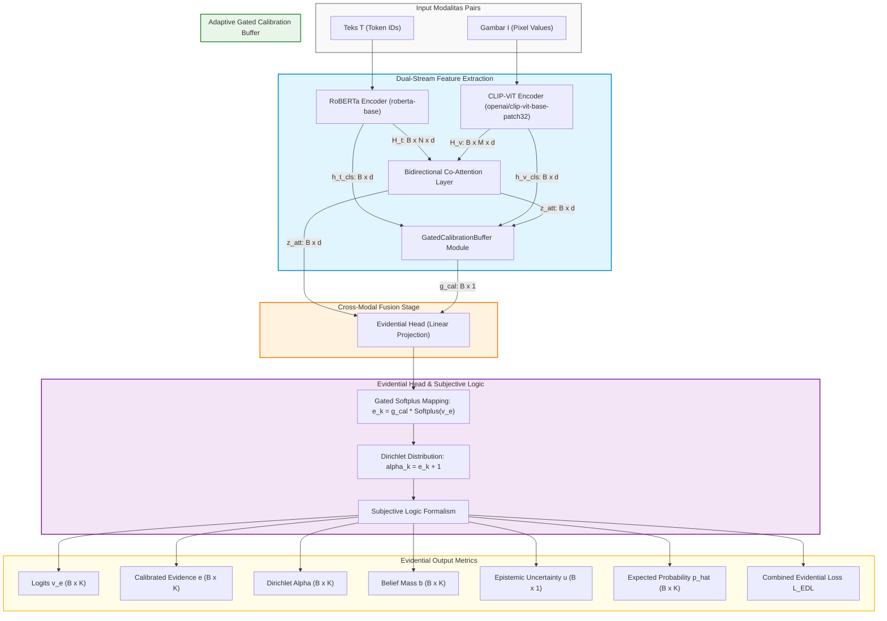
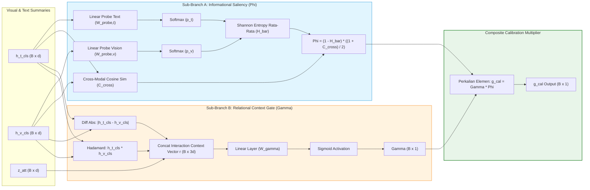

# Dokumentasi Komprehensif: Adaptive Evidential Multimodal Sentiment Analysis dengan Gated Calibration Buffer (ADEF)

Dokumen ini berisi penjelasan teknis, arsitektur sistem, formulasi matematika, diagram Mermaid, dan panduan penggunaan untuk pipeline **Adaptive Evidential Multimodal Sentiment Analysis dengan Gated Calibration Buffer (ADEF)** yang diimplementasikan pada file [`adef_gated_calibration_buffer.ipynb`](file:///D:/Coding/Project/All%20Thesis/Adaptive%20Evidential%20Fusion/adef_gated_calibration_buffer.ipynb).

---

## 1. Pendahuluan & Ringkasan Eksekutif

Dalam Multimodal Sentiment Analysis (MSA), penggabungan modalitas teks dan visual sering menghadapi tantangan konflik informasi, kebisingan data (*noisy features*), dan ketidakpastian prediksi. Arsitektur **Adaptive Evidential Fusion (ADEF)** menggabungkan **Evidential Deep Learning (EDL)** dan **Subjective Logic (SL)** dengan **Gated Calibration Buffer** untuk mengukur ketidakpastian epistemik (*epistemic uncertainty*) secara eksplisit.

### Inovasi Utama:
1. **Dual-Stream Pretrained Encoders**: Menggunakan **RoBERTa-base** untuk pemrosesan teks dan **CLIP-ViT-base-patch32** untuk pemrosesan gambar.
2. **Bidirectional Multi-Head Co-Attention Layer**: Mekanisme atensi silang (*cross-attention*) yang menyelaraskan fitur urutan teks dan patch visual.
3. **Adaptive Gated Calibration Buffer**: Modul pengkalibrasi evidensi komposit yang menggabungkan:
   - **Sub-Branch A (Informational Saliency $\Phi$)**: Pengukuran keselarasan non-parametrik dari rata-rata entropi Shannon unimodal ($\bar{H}$) dan konkordansi kosinus antar-modalitas ($C_{cross}$).
   - **Sub-Branch B (Relational Context Gate $\gamma$)**: Gate parametrik berbasis vektor interaksi relasional modalitas ($\mathbf{r}$).
4. **Head Evidensial & Subjective Logic**: Pemetaan logit terkalibrasi ke parameter distribusi Dirichlet ($\boldsymbol{\alpha}$), menghasilkan estimasi probabilitas ($\hat{\mathbf{p}}$), massa kepercayaan (*belief mass* $\mathbf{b}$), dan ketidakpastian epistemik (*epistemic uncertainty* $u$).
5. **Loss Evidensial Terintegrasi ($\mathcal{L}_{EDL}$)**: Menggabungkan Brier/MSE loss, regularisasi KL Divergence berpenjadwalan anneal, dan auxiliary cross-entropy loss untuk probe unimodal.

---

## 2. Diagram Arsitektur Sistem (Mermaid Diagrams)

### 2.1 Aliran Utama Pipeline (Main Data Flow Architecture)



---

### 2.2 Arsitektur Detail Gated Calibration Buffer (`GatedCalibrationBuffer`)



---

## 3. Spesifikasi Matematika & Komponen Utama

### 3.1 Dual-Stream Feature Extraction Stage
- **Teks Stream**: Memproses tokenized text $T$ melalui `RoBERTa`.
  $$\mathbf{H}_t = \text{RoBERTa}(T) \in \mathbb{R}^{B \times N \times d}$$
  $$\mathbf{h}_t^{cls} = \mathbf{H}_t[:, 0, :] \in \mathbb{R}^{B \times d}$$
- **Visi Stream**: Memproses citra $I$ melalui `CLIP-ViT`.
  $$\mathbf{H}_v = \text{CLIP-ViT}(I) \in \mathbb{R}^{B \times M \times d}$$
  $$\mathbf{h}_v^{cls} = \text{CLIP-ViT}_{\text{pooled}}(I) \in \mathbb{R}^{B \times d}$$

### 3.2 Bidirectional Multi-Head Co-Attention Layer
Matriks atensi silang dihitung antara representasi teks $\mathbf{H}_t$ dan citra $\mathbf{H}_v$:
$$\mathbf{A}^{t \to v} = \text{Softmax}\left( \frac{(\mathbf{H}_t \mathbf{W}_Q) (\mathbf{H}_v \mathbf{W}_K)^T}{\sqrt{d_k}} \right) \in \mathbb{R}^{B \times h \times N \times M}$$

Hasil agregasi fitur visual $\mathbf{H}_v \mathbf{W}_V$ diproyeksikan dan di-mean-pool pada dimensi urutan token $N$:
$$\mathbf{z}_{att} = \frac{1}{N} \sum_{i=1}^N \mathbf{Z}_{cross, i} \in \mathbb{R}^{B \times d}$$

### 3.3 Adaptive Gated Calibration Buffer
Buffer ini mengukur keyakinan sinyal multimodal sebelum mengkalibrasi evidensi:

#### Sub-Branch A (Informational Saliency $\Phi$):
1. **Unimodal Probes**: Probabilitas kelas unimodal $\mathbf{p}_t = \text{Softmax}(\mathbf{W}_{probe,t} \mathbf{h}_t^{cls})$ dan $\mathbf{p}_v = \text{Softmax}(\mathbf{W}_{probe,v} \mathbf{h}_v^{cls})$.
2. **Normalized Shannon Entropy ($\bar{H}$)**:
   $$\bar{H} = \frac{-1}{2 \log_2(K)} \sum_{k=1}^K \left( p_{t,k} \log_2(p_{t,k} + \epsilon) + p_{v,k} \log_2(p_{v,k} + \epsilon) \right) \in [0, 1]$$
3. **Cross-Modal Cosine Concordance ($C_{cross}$)**:
   $$C_{cross} = \frac{\mathbf{h}_t^{cls} \cdot \mathbf{h}_v^{cls}}{\|\mathbf{h}_t^{cls}\|_2 \|\mathbf{h}_v^{cls}\|_2 + \epsilon} \in [-1, 1]$$
4. **Saliency Factor ($\Phi$)**:
   $$\Phi = (1 - \bar{H}) \cdot \left( \frac{1 + C_{cross}}{2} \right) \in [0, 1]$$

#### Sub-Branch B (Relational Context Gate $\gamma$):
1. **Context Vector ($\mathbf{r}$)**:
   $$\mathbf{r} = \left[ \mathbf{z}_{att} \, \Vert \, |\mathbf{h}_t^{cls} - \mathbf{h}_v^{cls}| \, \Vert \, (\mathbf{h}_t^{cls} \odot \mathbf{h}_v^{cls}) \right] \in \mathbb{R}^{B \times 3d}$$
2. **Context Gate ($\gamma$)**:
   $$\gamma = \sigma(\mathbf{W}_\gamma \mathbf{r} + b_\gamma) \in (0, 1)$$

#### Composite Calibration Factor ($g_{cal}$):
$$g_{cal} = \gamma \cdot \Phi \in [0, 1]$$

---

### 3.4 Evidential Head & Subjective Logic Layer
- Logit tak terkalibrasi: $\mathbf{v}_e = \mathbf{W}_e \mathbf{z}_{att} + \mathbf{b}_e \in \mathbb{R}^{B \times K}$.
- Evidensi terkalibrasi $e_k$:
  $$e_k = g_{cal} \cdot \text{Softplus}(v_{e,k}) = g_{cal} \cdot \ln(1 + \exp(v_{e,k})) \ge 0$$
- Parameter Distribusi Dirichlet $\boldsymbol{\alpha}$:
  $$\alpha_k = e_k + 1 \implies \boldsymbol{\alpha} = [\alpha_1, \dots, \alpha_K]^T$$
- Parameter Subjective Logic:
  - Kekuatan Dirichlet Total: $S = \sum_{k=1}^K \alpha_k = \sum_{k=1}^K e_k + K$
  - Massa Kepercayaan (*Belief Mass*): $b_k = \frac{e_k}{S}$
  - Ketidakpastian Epistemik (*Epistemic Uncertainty*): $u = \frac{K}{S} \in (0, 1]$
  - Estimasi Probabilitas: $\hat{p}_k = \frac{\alpha_k}{S}$

---

### 3.5 Fungsi Kerugian Evidensial (`EvidentialLoss`)
Fungsi kerugian total dirumuskan sebagai:
$$\mathcal{L}_{EDL} = \mathcal{L}_{MSE} + \lambda_{KL} \cdot \mathcal{L}_{KL} + \lambda_{aux} \cdot (\mathcal{L}_{CE,t} + \mathcal{L}_{CE,v})$$

1. **Expected Mean Squared Error Loss ($\mathcal{L}_{MSE}$)**:
   $$\mathcal{L}_{MSE} = \frac{1}{B} \sum_{i=1}^B \sum_{k=1}^K \left[ (y_{i,k} - \hat{p}_{i,k})^2 + \frac{\hat{p}_{i,k}(1 - \hat{p}_{i,k})}{S_i + 1} \right]$$
   di mana $\mathbf{y}_i$ adalah vektor target one-hot.

2. **KL Divergence Regularization Loss ($\mathcal{L}_{KL}$)**:
   Mencegah pembentukan evidensi berlebih pada kelas non-target menuju prior Dirichlet seragam $\text{Dir}(\mathbf{1})$:
   $$\tilde{\boldsymbol{\alpha}}_i = \mathbf{y}_i + (1 - \mathbf{y}_i) \odot \boldsymbol{\alpha}_i$$
   $$\text{KL}(\text{Dir}(\tilde{\boldsymbol{\alpha}}_i) \parallel \text{Dir}(\mathbf{1})) = \ln \left( \frac{\Gamma(\sum_{k=1}^K \tilde{\alpha}_{i,k})}{\Gamma(K) \prod_{k=1}^K \Gamma(\tilde{\alpha}_{i,k})} \right) + \sum_{k=1}^K (\tilde{\alpha}_{i,k} - 1) \left[ \psi(\tilde{\alpha}_{i,k}) - \psi\left(\sum_{j=1}^K \tilde{\alpha}_{i,j}\right) \right]$$
   di mana $\psi$ adalah fungsi digamma (`torch.digamma`) dan $\Gamma$ adalah fungsi gamma (`torch.lgamma`).
   Beban regularisasi diawali secara bertahap menggunakan annealing factor:
   $$\lambda_{KL} = \min\left(1.0, \frac{\text{epoch}}{\text{max\_anneal\_epochs}}\right)$$

3. **Auxiliary Cross-Entropy Loss ($\mathcal{L}_{aux}$)**:
   Memberikan pembaruan gradien langsung pada probe linear unimodal ($\mathbf{W}_{probe,t}, \mathbf{W}_{probe,v}$):
   $$\mathcal{L}_{aux} = \frac{1}{2} \left( \text{CrossEntropy}(\mathbf{p}_{probe,t}, y) + \text{CrossEntropy}(\mathbf{p}_{probe,v}, y) \right)$$

---

## 4. Struktur Modul PyTorch

Berikut adalah daftar kelas PyTorch yang diimplementasikan dalam [`adef_gated_calibration_buffer.ipynb`](file:///D:/Coding/Project/All%20Thesis/Adaptive%20Evidential%20Fusion/adef_gated_calibration_buffer.ipynb):

| Nama Kelas | Deskripsi & Peran | Shape Output Utama |
| :--- | :--- | :--- |
| `TextStreamEncoder` | Feature extractor berbasis RoBERTa-base dengan proyeksi linear | $H_t \in [B, N, d], h_t^{cls} \in [B, d]$ |
| `VisionStreamEncoder` | Feature extractor berbasis CLIP-ViT-base-patch32 | $H_v \in [B, M, d], h_v^{cls} \in [B, d]$ |
| `BidirectionalCoAttention` | Cross-attention multi-head antara teks dan citra dengan mean-pooling | $z_{att} \in [B, d]$ |
| `GatedCalibrationBuffer` | Perhitungan $g_{cal}$ via Informational Saliency ($\Phi$) & Relational Context Gate ($\gamma$) | $g_{cal} \in [B, 1]$ |
| `EvidentialLoss` | Perhitungan kerugian kombinasi $\mathcal{L}_{MSE} + \lambda_{KL}\mathcal{L}_{KL} + \lambda_{aux}\mathcal{L}_{aux}$ | Scalar Loss Tensor |
| `ADEFGatedCalibrationModel` | Model utama PyTorch yang menggabungkan seluruh komponen di atas | Structured Output Dict |

---

## 5. Panduan Penggunaan & Eksekusi Notebook

### 5.1 Struktur Output Dictionary Model
Metode `forward()` pada `ADEFGatedCalibrationModel` menerima `input_ids`, `attention_mask`, `pixel_values`, dan `labels` (opsional), lalu mengembalikan dictionary berisi:

```python
output = {
    "logits": v_e,           # Logit uncalibrated [B, K]
    "evidence": evidence,     # Calibrated evidence e_k >= 0 [B, K]
    "alpha": alpha,           # Parameter Dirichlet alpha_k >= 1 [B, K]
    "belief": belief,         # Massa kepercayaan b_k [B, K]
    "uncertainty": uncertainty, # Ketidakpastian epistemik u [B, 1]
    "expected_p": expected_p, # Estimasi probabilitas p_hat [B, K]
    "g_cal": g_cal,           # Calibration multiplier [B, 1]
    "saliency_phi": saliency_phi, # Saliency factor Phi [B, 1]
    "gate_gamma": gate_gamma,   # Relational gate gamma [B, 1]
    "loss": total_loss        # Loss total EDL (jika labels diberikan)
}
```

### 5.2 Cara Menjalankan Notebook
1. Buka notebook [`adef_gated_calibration_buffer.ipynb`](file:///D:/Coding/Project/All%20Thesis/Adaptive%20Evidential%20Fusion/adef_gated_calibration_buffer.ipynb).
2. Pastikan kernel Jupyter menggunakan environment `env_gpu_pytorch_erl` atau PyTorch dengan dukungan CUDA.
3. Jalankan sel secara berurutan:
   - **Sel 1-2**: Import pustaka & penyiapan random seed (`42`).
   - **Sel 3-4**: Konfigurasi `CFG` (backbone, learning rate, batch size).
   - **Sel 5-6**: Preprocessing dataframe dataset MVSA-Single & `MultimodalDataset`.
   - **Sel 7-8**: Inisialisasi encoder dual-stream & co-attention.
   - **Sel 9-10**: Inisialisasi `GatedCalibrationBuffer` & model `ADEFGatedCalibrationModel`.
   - **Sel 11-12**: Inisialisasi `EvidentialLoss`.
   - **Sel 13-14**: Fungsi pelatihan `train_one_epoch` & evaluasi `evaluate`.
   - **Sel 15-16**: Tes verifikasi arsitektur pada synthetic batch.
   - **Sel 17**: Eksekusi pelatihan 5 epoch & pengujian akhir pada test set.

---

## 6. Verifikasi & Pengujian Runtime

Model telah diverifikasi melalui tes otomatis pada synthetic batch `(batch_size=2)` dan dataset MVSA-Single (`4,511` sampel). Seluruh tensor output telah dikonfirmasi memiliki bentuk (*shape*) dan tipe data yang sesuai dengan spesifikasi matematika.
